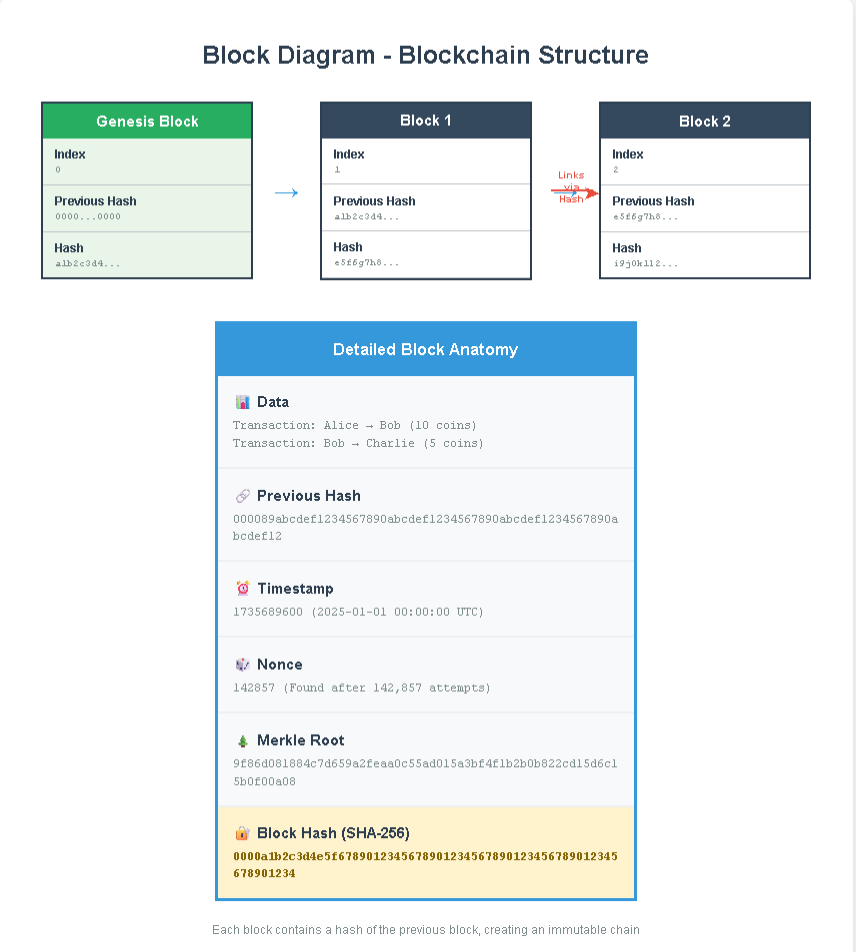
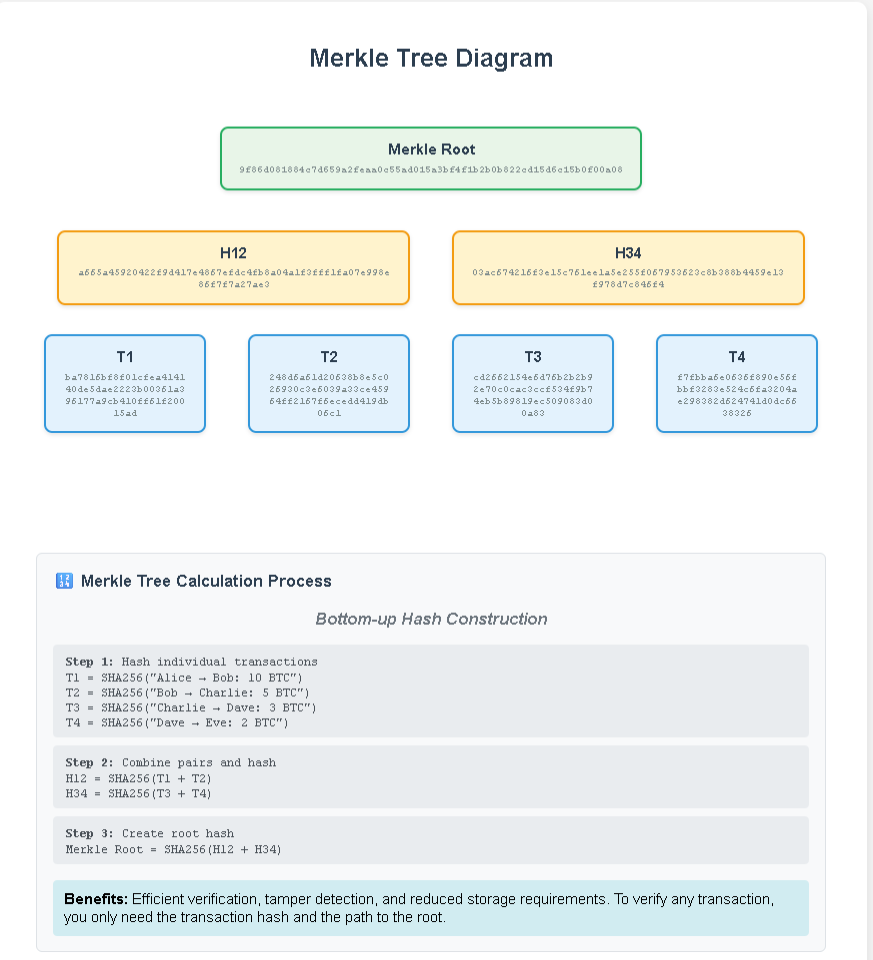

# Mini Blockchain Project

## 🧱 Block Diagram - Blockchain Structure

## 🌲 Merkle Tree Diagram

## 📂 Overview
This repo contains basic blockchain implementation with:
- Block class & chain linking
- Proof-of-Work mining simulation
- Consensus simulation for PoW, PoS, DPoS

See `blockchain_simulation.py`, `mining_simulation.py`, and `consensus_demo.py` for code.
